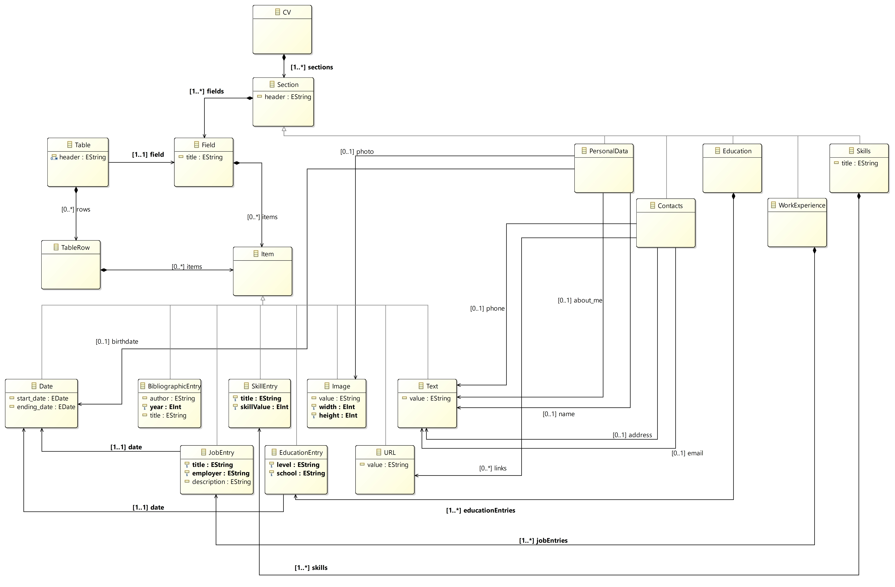

# TACS-PROJ

GitHub repository for TACS' (22/23) project

|Name|Uni ID|
|----|------|
|Nuno Oliveira|up201806525|
|Daniel Garcia Silva|up201806524|
|Luís Miguel Pinto|up201806206|

#Assignment 1

## Metamodel for CVs

Concepts|Intrisic Properties|Extrinsic Properties
-|-|-
CV | | An arbirtray number of *Sections*  
Section | header: String | An arbitrary number of *Fields*
Field | title: String | An arbitrary number of *Items*
PersonalData | | A **name** and an **about me**, two *Texts*   A **photo**, one *Image*   A **birthdate**, one *Date*
Contacts | | An **address**, a **phone** number and an **email**, three *Texts*   An arbitrary number of *URLs*
Education | | An arbitrary number of *EducationEntries*
WorkExperience | | An arbitrary number of *JobEntries*
Skills | title: String | An arbitrary number of *SkillEntries*
Table | header: list of Strings | One *Field*   An arbitrary number of *TableRows*
TableRow | | An arbitrary number of *Items*
Text | value: String |
Date | start_date: Date   ending_date: Date |
URL | value: String
Image | value: String   width: Integer   height: Integer |
BibliographicEntry | author: String   year: Integer   title: String |
JobEntry | title: String   employer: String   description: String | One *Date*
EducationEntry | level: String   school: String | One *Date*
SkillEntry | title: String   skillValue: Integer |

## OCL Restrictions

## Metamodel UML

## Notes on the first assignment

To develop our metamodel we took a sort of reverse engineering aproach. 

After gathering CV's from multiple sources and from people in different working areas we viewed CV's as a bunch of sections. Some of these sections have a somewhat regular structure while others not so much. Despite that, all sections are composed by some basic structured text elements and we started to plan our model from that. The basic structured elements we identified are subclasses of ``Item``.

A ``Field`` should be thought of as a subsection. It can have a title and have multiple ``Item`` or have a ``Table``. A ``Table`` has a list of strings that represents the headers and a bunch of ``TableRow``, where each has ``Items`` for each column.

Furthermore, a ``Section`` is self-explanatory and is composed by ``Field`` while ``CV`` is composed by ``Section``. 

With this, a user has all the tools to make almost anything. Regardless, there is too much freedom and very little structure and thats why we introduced to the metamodel subclasses of ``Section``. Each subclass represents a section that is present in almost every CV in a very similar structure across all of them. Each subclass has a defined set of attributes to use.
